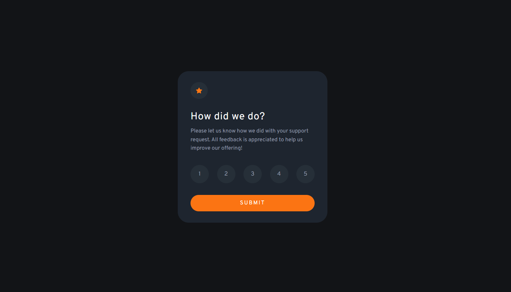

# Frontend Mentor - Interactive rating component solution

This is a solution to the [Interactive rating component challenge on Frontend Mentor](https://www.frontendmentor.io/challenges/interactive-rating-component-koxpeBUmI). Frontend Mentor challenges help you improve your coding skills by building realistic projects. 

## Table of contents

- [Overview](#overview)
  - [The challenge](#the-challenge)
  - [Screenshot](#screenshot)
  - [Links](#links)
- [My process](#my-process)
  - [Built with](#built-with)
  - [What I learned](#what-i-learned)
  - [Continued development](#continued-development)
- [Author](#author)

## Overview

### The challenge

Users should be able to:

- View the optimal layout for the app depending on their device's screen size
- See hover states for all interactive elements on the page
- Select and submit a number rating
- See the "Thank you" card state after submitting a rating

### Screenshot



### Links

- Solution URL: [Solution code](https://github.com/Ofcl-Javed/Rating-card)
- Live Site URL: [Live site](https://ofcl-javed.github.io/Rating-card)

## My process

### Built with

- Semantic HTML5 markup
- SCSS custom properties
- Basic JavaScript
- CSS Grid
- Desktop-first workflow
- [SASS](https://sass-lang.com//) - CSS preprocessor

### What I learned
I have practice SCSS with it and learn how to hide highlight color on button clicking.
```css
* {
  -webkit-tap-highlight-color: transparent;
}
```

### Continued development

I like to continue learn CSS for efficiency and compatiblity

## Author

- Website - [Javed](https://ofcl-javed.github.io/findjaved/)
- Frontend Mentor - [Ofcl-Javed](https://www.frontendmentor.io/profile/Ofcl-Javed)
- Github - [Ofcl-Javed]](https://github.com/Ofcl-Javed)